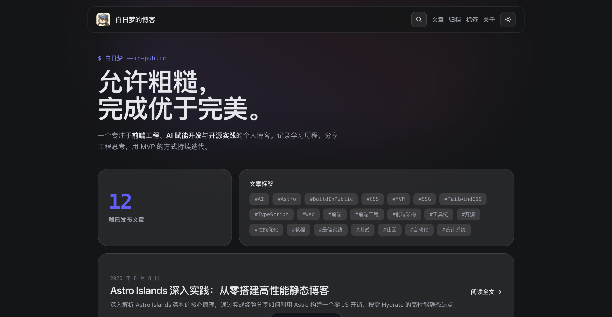
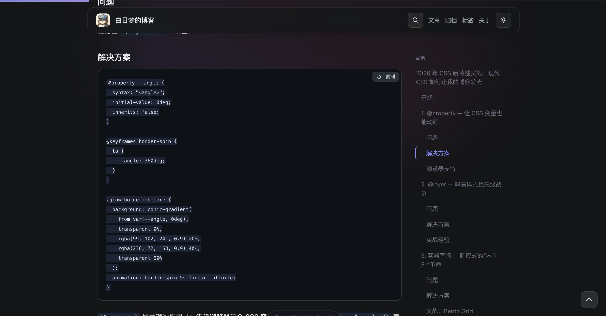
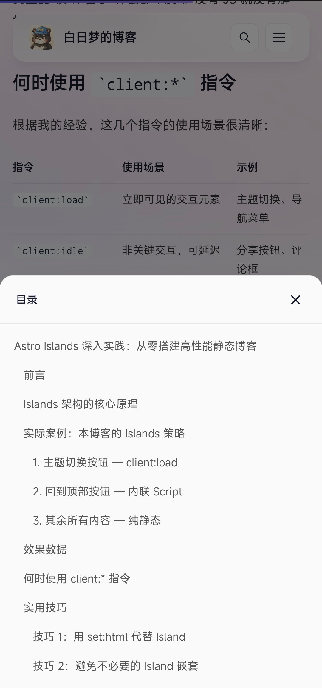

# 白日梦的博客

<div align="center">

[](https://astro.build)
[](https://tailwindcss.com)
[](https://www.typescriptlang.org/)
[](LICENSE)

⚡ **Astro v7 + Tailwind CSS v4 开源博客模板** — 全站搜索 · 双主题 · Shiki 代码高亮 · RSS 订阅，五分钟搭建你的技术博客。

**我的博客地址**：https://mvp-blog-pearl.vercel.app

</div>
</div>

---

## 目录

- [项目简介](#项目简介)
- [功能特性](#功能特性)
- [技术栈](#技术栈)
- [快速开始](#快速开始)
- [安装步骤](#安装步骤)
- [配置说明](#配置说明)
- [内容管理](#内容管理)
- [使用指南](#使用指南)
- [目录结构](#目录结构)
- [API 文档](#api-文档)
- [贡献指南](#贡献指南)
- [许可证信息](#许可证信息)
- [联系方式](#联系方式)

---

## 项目简介

**白日梦的博客** 是一个开源的、基于 [Astro](https://astro.build) 构建的静态博客站点。该项目以 **Build in Public**（公开构建）为核心理念，记录前端工程化、系统设计、AI 原生应用开发等方面的思考与实践。

项目采用 SSG（静态站点生成）架构，所有页面在构建时预渲染为纯静态 HTML，具有极佳的加载速度和 SEO 表现。内容以 Markdown 文件管理，配合 Astro Content Collections 实现类型安全的内容查询。

<div align="center">





<p>
  
  
</p>

</div>

---

## 功能特性

### 📝 文章管理

- **Markdown 撰写** — 使用 Markdown 编写文章，支持所有标准语法
- **Frontmatter 校验** — 基于 Zod schema 的 frontmatter 类型安全校验
- **草稿机制** — 设置 `draft: true` 即可将文章隐藏，发布时改为 `false`
- **阅读时间估算** — 基于中文平均阅读速度自动计算（~400 字/分钟）
- **上一篇/下一篇导航** — 文章底部自动生成前后篇导航

### 🏷️ 标签系统

- **自动聚合** — 标签从文章 frontmatter 自动提取，无需手动维护
- **标签云** — 首页展示所有标签的云图
- **标签筛选** — 点击标签可查看该标签下的所有文章
- **中文标签支持** — 自动 URL 编码，完美支持中文标签

### 🔍 全文搜索

- **离线搜索** — 基于 Fuse.js 实现客户端全文搜索
- **搜索索引** — 构建时生成 `search-index.json`，包含标题、描述和正文摘要
- **模糊匹配** — 支持容错搜索，不要求精确输入
- **快捷键** — `⌘K` / `Ctrl+K` 快速打开搜索框

### 🎨 主题与视觉

- **深色/浅色主题** — 手动切换或跟随系统偏好
- **防闪烁机制** — 主题初始化脚本在 `<head>` 中同步执行，彻底消除 FOUC
- **代码高亮** — Shiki 引擎，亮色/暗色双主题（GitHub Light / GitHub Dark Dimmed）
- **发光边框动画** — CSS `@property` + `conic-gradient` 实现的悬停发光效果
- **颗粒纹理** — 纯 CSS 实现的噪点背景
- **渐入动画** — 页面元素 fade-up、slide-down 等平滑动画

### 📊 页面功能

- **文章目录** — 自动提取标题生成 TOC（支持滚动高亮）
- **阅读进度条** — 页面顶部显示阅读进度指示器
- **归档时间线** — 按时间排列的文章归档页
- **分页浏览** — 博客列表支持分页
- **统计卡片** — 首页显示文章总数等统计信息
- **回到顶部** — 右下角悬浮的回到顶部按钮
- **响应式设计** — 从移动端到桌面端的完整适配

### 🌐 SEO 与订阅

- **SEO Head** — 每个页面自动生成 Open Graph / Twitter Card 元标签
- **RSS Feed** — 自动生成 `/rss.xml`，支持 RSS 订阅
- **Sitemap** — 自动生成 `/sitemap-index.xml`，帮助搜索引擎索引
- **语义化 HTML** — 使用 `article`、`nav`、`section` 等语义标签

---

## 技术栈

| 类别         | 技术                                                                               | 用途                 |
| ------------ | ---------------------------------------------------------------------------------- | -------------------- |
| **框架**     | [Astro v7](https://astro.build)                                                    | 静态站点生成器       |
| **语言**     | [TypeScript](https://www.typescriptlang.org/)                                      | 类型安全的开发语言   |
| **样式**     | [Tailwind CSS v4](https://tailwindcss.com)                                         | CSS 工具类框架       |
| **排版**     | [@tailwindcss/typography](https://github.com/tailwindlabs/tailwindcss-typography)  | 文章内容排版         |
| **代码高亮** | [Shiki](https://shiki.style)                                                       | 代码语法高亮         |
| **搜索**     | [Fuse.js](https://fusejs.io)                                                       | 客户端模糊搜索       |
| **RSS**      | [@astrojs/rss](https://docs.astro.build/en/guides/rss/)                            | RSS Feed 生成        |
| **Sitemap**  | [@astrojs/sitemap](https://docs.astro.build/en/guides/integrations-guide/sitemap/) | Sitemap 生成         |
| **包管理**   | [pnpm](https://pnpm.io)                                                            | 包管理器             |
| **部署**     | 纯静态输出                                                                         | 可部署到任何静态托管 |

---

## 快速开始

### 前提条件

- **Node.js** >= 22.12.0
- **pnpm** （推荐使用 corepack 启用：`corepack enable`）

### 启动开发服务器

```bash
# 克隆项目
git clone https://github.com/Hugo-Xuuu/mvp-blog.git
cd mvp-blog

# 安装依赖
pnpm install

# 启动开发服务器
pnpm dev
```

浏览器访问 `http://localhost:4321` 即可预览。

### 构建与部署

```bash
# 构建生产版本
pnpm build

# 预览构建结果
pnpm preview
```

构建产物输出到 `dist/` 目录，可直接部署到任何静态托管平台（Vercel、Netlify、Cloudflare Pages 等）。

---

## 安装步骤

### 1. 克隆项目

```bash
git clone https://github.com/Hugo-Xuuu/mvp-blog.git
cd mvp-blog
```

### 2. 安装依赖

推荐使用 pnpm：

```bash
pnpm install
```

如果未安装 pnpm，可通过 npm 安装：

```bash
npm install -g pnpm
```

### 3. 配置站点信息

编辑 [`src/lib/utils.ts`](src/lib/utils.ts#L53-L61) 中的 `SITE_CONFIG` 常量：

```typescript
export const SITE_CONFIG = {
  name: "你的博客名称",
  shortName: "简称",
  description: "博客描述",
  url: "https://你的域名.com",
  language: "zh-CN",
  author: "作者名",
  copyright: "版权信息",
};
```

### 4. 更新站点 URL

编辑 [`astro.config.mjs`](astro.config.mjs#L9) 中的 `site` 配置：

```javascript
export default defineConfig({
  site: "https://你的域名.com", // 修改为你的实际域名
  // ...
});
```

### 5. 启动开发

```bash
pnpm dev
```

---

## 配置说明

### 站点配置

所有品牌信息集中管理在 [`src/lib/utils.ts`](src/lib/utils.ts#L53-L61) 的 `SITE_CONFIG` 对象中：

| 字段          | 类型     | 说明         |
| ------------- | -------- | ------------ |
| `name`        | `string` | 站点完整名称 |
| `shortName`   | `string` | 站点短名称   |
| `description` | `string` | 站点描述     |
| `url`         | `string` | 站点域名     |
| `language`    | `string` | 站点语言     |
| `author`      | `string` | 作者名称     |
| `copyright`   | `string` | 版权声明     |

### Astro 配置

核心配置在 [`astro.config.mjs`](astro.config.mjs)：

| 配置项          | 说明                                   |
| --------------- | -------------------------------------- |
| `site`          | 站点域名，影响 Sitemap 和 RSS 中的 URL |
| `trailingSlash` | URL 尾斜杠策略（设为 `never`）         |
| `integrations`  | 集成插件（Sitemap）                    |
| `markdown`      | Shiki 代码高亮双主题配置               |

### 内容 Schema

文章 frontmatter 使用 Zod 校验，定义在 [`src/content.config.ts`](src/content.config.ts)：

| 字段          | 类型       | 必填 | 默认值  | 说明           |
| ------------- | ---------- | ---- | ------- | -------------- |
| `title`       | `string`   | ✅   | —       | 文章标题       |
| `date`        | `Date`     | ✅   | —       | 发布日期       |
| `tags`        | `string[]` | ❌   | `[]`    | 文章标签列表   |
| `description` | `string`   | ❌   | —       | 描述（SEO 用） |
| `draft`       | `boolean`  | ❌   | `false` | 是否为草稿     |
| `coverImage`  | `string`   | ❌   | —       | 封面图片路径   |

### 主题变量

样式主题变量定义在 [`src/styles/global.css`](src/styles/global.css)，CSS 自定义属性体系：

- 亮色模式 — `:root` 下的 `--bg-*`、`--text-*` 等变量
- 暗色模式 — `.dark` 选择器下的对应变量覆盖

---

## 内容管理

### 撰写文章

1. 在 [`src/content/blog/`](src/content/blog/) 目录下创建 `.md` 文件
2. 文件名将成为 URL slug（建议英文小写 + 连字符）
3. 在文件顶部编写 YAML frontmatter
4. 正文使用标准 Markdown 语法

推荐复制项目根目录的 [`post-template.md`](post-template.md) 作为模板：

```bash
cp post-template.md src/content/blog/my-new-post.md
```

### Frontmatter 示例

```yaml
---
title: "Astro 框架入门指南"
date: 2026-08-08
tags: ["Astro", "前端", "教程"]
description: "一文带你快速上手 Astro 框架的核心概念与使用技巧。"
draft: false
---
```

### 草稿管理

将 `draft` 设为 `true` 即可隐藏文章（不会出现在首页、列表、标签页、归档、RSS 中）：

```yaml
draft: true
```

发布时改为 `draft: false` 即可。

### 标签管理

标签完全自动管理，只需在 frontmatter 中设置 `tags` 数组即可：

- 所有标签自动出现在首页标签云和 `/tags` 标签页
- 点击标签进入 `/tags/[标签名]` 查看该标签下所有文章
- 标签 URL 会自动编码（支持中文标签）

### 更多说明

详细的撰写指南请参阅 [`content-management-guide.md`](content-management-guide.md)，涵盖：

- 编辑与删除文章
- 标签命名建议
- 主题与黑暗模式使用
- 构建与部署
- 完整文件结构
- 常见问题

---

## 使用指南

### 页面路由

| 路由                 | 说明             |
| -------------------- | ---------------- |
| `/`                  | 首页             |
| `/blog`              | 博客列表         |
| `/blog/page/[page]`  | 博客分页         |
| `/blog/[slug]`       | 文章详情         |
| `/tags`              | 标签总览         |
| `/tags/[tag]`        | 标签筛选         |
| `/archive`           | 归档时间线       |
| `/about`             | 关于页面         |
| `/rss.xml`           | RSS 订阅         |
| `/search-index.json` | 搜索索引（JSON） |
| `/*` （未匹配）      | 404 页面         |

### 主题切换

- 点击导航栏右侧的 **月亮/太阳图标** 手动切换
- 首次访问自动跟随 **系统偏好**（`prefers-color-scheme`）
- 手动选择后偏好保存在 `localStorage`，后续访问保持不变
- 清空 `localStorage` 后重新跟随系统偏好

### 搜索功能

- 点击搜索图标或按 `⌘K`（Mac）/ `Ctrl+K`（Windows）打开搜索
- 输入关键词即可实时搜索文章标题和内容
- 搜索结果可点击直接跳转

---

## 目录结构

```
mvp-blog/
├── public/                       # 静态资源
│   ├── avatar.jpg                # 头像
│   ├── favicon.ico               # 网站图标
│   ├── favicon.svg               # SVG 图标
│   └── images/                   # 图片资源
├── src/
│   ├── components/               # UI 组件
│   │   ├── ArchiveTimeline.astro # 归档时间线
│   │   ├── BackToTop.astro       # 回到顶部按钮
│   │   ├── Footer.astro          # 页脚
│   │   ├── GrainOverlay.astro    # 颗粒纹理叠加层
│   │   ├── Header.astro          # 页面头部导航
│   │   ├── HeroSection.astro     # 首页英雄区域
│   │   ├── Pagination.astro      # 分页组件
│   │   ├── PostCard.astro        # 文章卡片
│   │   ├── PostMeta.astro        # 文章元数据（日期、阅读时间）
│   │   ├── SearchDialog.astro    # 搜索弹窗
│   │   ├── SEOHead.astro         # SEO 元标签
│   │   ├── StatsCard.astro       # 统计卡片
│   │   ├── TableOfContents.astro # 文章目录
│   │   ├── TagBadge.astro        # 标签徽章
│   │   ├── TagCloud.astro        # 标签云
│   │   └── ThemeToggle.astro     # 主题切换按钮
│   ├── content/
│   │   └── blog/                 # 博客文章（Markdown）
│   │       ├── hello-world.md
│   │       ├── my-second-post.md
│   │       └── ...               # 更多文章
│   ├── layouts/
│   │   └── Layout.astro          # 全局布局组件
│   ├── lib/
│   │   ├── content.ts            # 内容查询工具函数
│   │   └── utils.ts              # 通用工具函数 + 站点配置
│   ├── pages/                    # 页面路由
│   │   ├── index.astro           # 首页
│   │   ├── 404.astro             # 404 页面
│   │   ├── about.astro           # 关于页面
│   │   ├── archive.astro         # 归档页面
│   │   ├── rss.xml.ts            # RSS Feed 生成
│   │   ├── search-index.json.ts  # 搜索索引生成
│   │   ├── blog/
│   │   │   ├── [slug].astro      # 文章详情页
│   │   │   ├── index.astro       # 博客列表页
│   │   │   └── page/
│   │   │       └── [page].astro  # 博客分页
│   │   └── tags/
│   │       ├── index.astro       # 标签总览页
│   │       └── [tag].astro       # 标签筛选页
│   ├── styles/
│   │   └── global.css            # 全局样式 + Tailwind CSS
│   └── types/
│       └── blog.ts               # TypeScript 类型定义
├── astro.config.mjs              # Astro 配置文件
├── content-management-guide.md    # 内容管理指南
├── post-template.md               # 文章模板
├── package.json                   # 项目依赖和脚本
├── pnpm-lock.yaml                 # pnpm 锁文件
├── pnpm-workspace.yaml            # pnpm 工作区配置
├── tsconfig.json                  # TypeScript 配置
├── AGENTS.md                      # AI 助手开发指南
├── CLAUDE.md                      # Claude 配置说明
├── LICENSE                        # MIT 许可证
└── README.md                      # 本文件
```

---

## API 文档

### 内容查询函数

定义在 [`src/lib/content.ts`](src/lib/content.ts)，用于在 Astro 组件的前置脚本中查询文章数据。

#### `getAllPosts()`

获取所有已发布的文章，按日期降序排列。

```typescript
async function getAllPosts(): Promise<BlogPost[]>;
```

**示例**：

```astro
---
import { getAllPosts } from '../lib/content';
const posts = await getAllPosts();
---
```

#### `getPostsByTag(tag)`

根据标签筛选文章。

```typescript
async function getPostsByTag(tag: string): Promise<BlogPost[]>;
```

**参数**：

- `tag` — 标签名称

**示例**：

```astro
---
const posts = await getPostsByTag("Astro");
---
```

#### `getAllTags()`

获取所有标签（去重后按字母/拼音排序）。

```typescript
async function getAllTags(): Promise<string[]>;
```

#### `getPostCount()`

获取已发布文章总数。

```typescript
async function getPostCount(): Promise<number>;
```

#### `getPaginatedPosts(page, pageSize)`

分页获取文章。

```typescript
async function getPaginatedPosts(
  page: number,
  pageSize?: number,
): Promise<{ posts: BlogPost[]; total: number; totalPages: number }>;
```

**参数**：

- `page` — 页码（从 1 开始）
- `pageSize` — 每页数量（默认 10）

**返回值**：

- `posts` — 当前页文章列表
- `total` — 文章总数
- `totalPages` — 总页数

### 工具函数

定义在 [`src/lib/utils.ts`](src/lib/utils.ts)。

#### `formatDate(date)`

将日期格式化为中文友好格式。

```typescript
function formatDate(date: Date): string;
// 示例：formatDate(new Date("2026-08-06")) => "2026 年 8 月 6 日"
```

#### `formatDateISO(date)`

将日期格式化为 ISO 短格式（用于 RSS）。

```typescript
function formatDateISO(date: Date): string;
// 示例：formatDateISO(new Date("2026-08-06")) => "2026-08-06"
```

#### `estimateReadingTime(text)`

估算文章阅读时间（基于 ~400 字/分钟的中文平均阅读速度）。

```typescript
function estimateReadingTime(text: string): number;
// 返回值：分钟数（至少 1）
```

#### `truncate(text, maxLength)`

截断文本到指定长度。

```typescript
function truncate(text: string, maxLength?: number): string;
// maxLength 默认 120
```

#### `buildTitle(pageTitle?)`

生成页面标题。

```typescript
function buildTitle(pageTitle?: string): string;
// 无参数时返回站点名称，有参数时返回 "页面标题 | 站点名称"
```

### 类型定义

定义在 [`src/types/blog.ts`](src/types/blog.ts)。

```typescript
/** 博客文章集合的条目类型 */
type BlogPost = CollectionEntry<"blog">;

/** 博客文章 frontmatter 字段类型 */
type BlogFrontmatter = BlogPost["data"];

/** 文章卡片展示所用的精简数据类型 */
type PostCardData = {
  slug: string;
  title: string;
  date: Date;
  tags: string[];
  description?: string;
};
```

### 搜索索引 API

**端点**：`/search-index.json`

**方法**：`GET`

**用途**：供前端搜索功能使用，包含所有文章的标题、描述和正文摘要。

**响应格式**：

```json
[
  {
    "slug": "astro-islands-in-depth",
    "title": "深入理解 Astro Islands 架构",
    "description": "文章描述",
    "content": "正文摘要...",
    "date": "2026-08-07"
  }
]
```

### RSS Feed

**端点**：`/rss.xml`

**方法**：`GET`

**用途**：RSS 订阅，包含所有已发布的文章。

---

## 测试方法

### 开发测试

```bash
# 启动开发服务器
pnpm dev
```

开发服务器默认在 `http://localhost:4321` 运行，支持热更新。

### 构建测试

```bash
# 生产构建
pnpm build

# 预览构建产物
pnpm preview
```

### 内容校验

- 文章 frontmatter 在构建时自动校验，不符合 Zod schema 会报错
- 确保所有文章包含 `title` 和 `date` 字段
- 检查标签拼写一致性

### 常见检查清单

- [ ] 所有文章 `draft` 字段正确设置
- [ ] 标签命名风格一致
- [ ] 封面图片路径正确
- [ ] 外部链接有效
- [ ] 代码块语言标识正确
- [ ] RSS Feed 可正常订阅
- [ ] 搜索功能正常工作
- [ ] 暗色/亮色主题切换正常
- [ ] 移动端响应式布局正常

---

## 贡献指南

欢迎贡献代码、报告问题或提出改进建议！

### 报告问题

1. 检查是否已有相似 Issues
2. 提供清晰的问题描述
3. 附上复现步骤和环境信息

### 提交 Pull Request

1. Fork 项目
2. 创建特性分支：`git checkout -b feature/your-feature`
3. 提交更改：`git commit -m 'feat: add some feature'`
4. 推送到分支：`git push origin feature/your-feature`
5. 提交 PR

### 开发规范

- **代码风格** — 项目使用 TypeScript，请保持类型安全
- **组件命名** — Astro 组件使用 `.astro` 扩展名，PascalCase 命名
- **文件命名** — Markdown 文章使用英文小写 + 连字符
- **提交信息** — 建议使用 [Conventional Commits](https://www.conventionalcommits.org/) 规范

### 分支管理

- `main` — 主分支，保持稳定可部署
- `feature/*` — 特性分支
- `fix/*` — 修复分支

---

## 联系方式

- **作者**：[Hugo-Xuuu](https://github.com/Hugo-Xuuu)
- **博客**：https://mvp-blog-pearl.vercel.app/ (需使用魔法)
- **Issues**：[GitHub Issues](https://github.com/Hugo-Xuuu/mvp-blog/issues)
- **项目地址**：[GitHub](https://github.com/Hugo-Xuuu/mvp-blog)
- **E-mail**：temp.gravity988@passinbox.com

---

<div align="center">
**如果这个项目对你有帮助，欢迎 Star ⭐**

</div>
